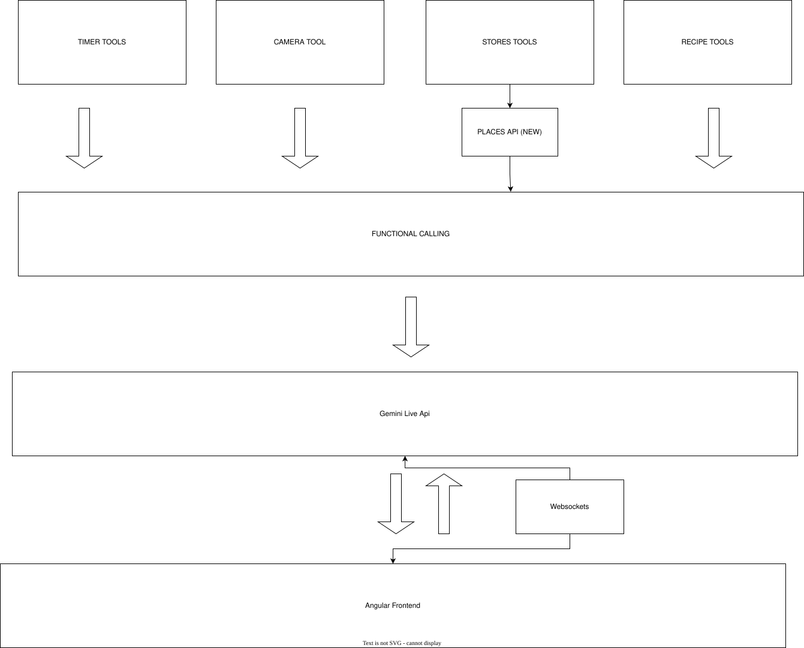
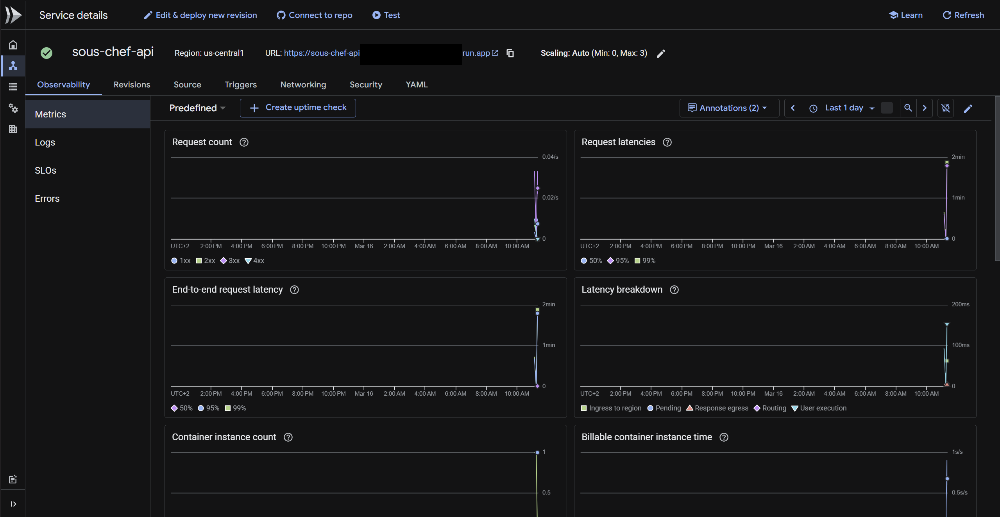
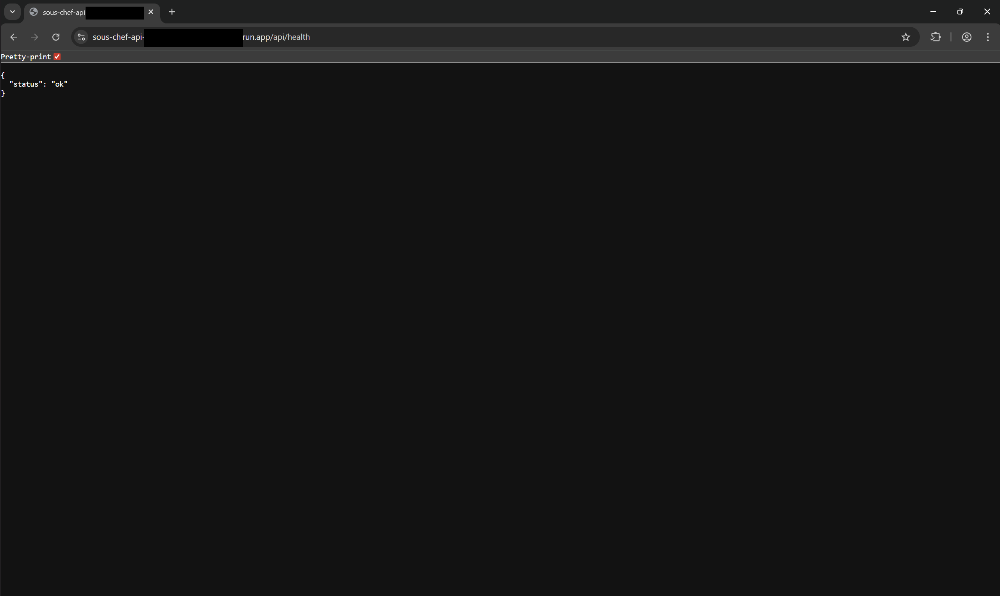

# Sous Chef

Voice-first cooking assistant powered by the **Gemini Live API**. Talk to it naturally—get recipes, set timers, find nearby stores, manage ingredients—with real-time audio and optional camera. Built for the [Gemini Live Agent Challenge](https://geminiliveagentchallenge.devpost.com/).

## What it does

- **Live voice** — Just talk. Interrupt anytime. Uses Gemini Live on Vertex AI with native audio.
- **Timers** — Start, pause, resume, add/remove time. Hours and minutes (e.g. “set a timer for 1 hour”).
- **Recipes** — On screen, edit, save, and mark ingredients as added by voice or tap.
- **Places** — “Where can I buy basil?” uses Google Places; requires `GOOGLE_MAPS_API_KEY` for place search and photos.
- **Camera** — Optional; send live video to the agent (e.g. “what’s in my fridge?”).
- **Settings** — Name, personality, response style, language, and voice are all configurable in the webapp.

---

## Sous Chef flow

The app is built as a **voice-first flow**: the user talks in the **Angular frontend**, which sends audio over **WebSockets** to the **Gemini Live API** (Vertex AI). The model uses **function calling** to invoke tools; results are sent back over the same WebSocket and the frontend updates the UI (timers, recipe, stores, camera).

1. **User** → speaks in the browser (Angular app).
2. **Angular frontend** → captures audio, sends it (and optional video) over a WebSocket to the backend.
3. **Backend** → forwards the stream to **Gemini Live API** and runs the **function-calling** layer.
4. **Tools** — The model can call:
   - **Timer tools** — start, pause, resume, add/remove time, cancel, reset, status.
   - **Recipe tools** — write recipe to screen, edit, save, list saved, show saved.
   - **Stores tools** — search places (Google Places API), hide stores list.
   - **Camera tool** — open/close the user’s camera for the agent.
5. **Results** → tool outputs and agent audio are sent back over the WebSocket; the frontend shows timers, recipe, places, and plays the reply.

A diagram of this flow is in the repo: **[sous-chef-useful-images/sous-chef-flow.svg](sous-chef-useful-images/sous-chef-flow.svg)**.



## What you need

- **Node.js** 18+ and **npm** (frontend)
- **Python** 3.12+ (backend)
- **Google Cloud project** with Vertex AI API and Google Maps/Places API enabled
- **gcloud CLI** for deployment — [install](https://cloud.google.com/sdk/docs/install)

---

## Run it locally

### Option A: One-command setup (after clone)

From the repo root, run the setup script (Bash — macOS/Linux, or Git Bash/WSL on Windows):

```bash
git clone https://github.com/ntaiko/sous-chef.git
cd sous-chef
chmod +x scripts/setup-project.sh
./scripts/setup-project.sh
```

This installs backend dependencies (Python venv + pip) and frontend dependencies (npm). It also copies `backend/.env.example` to `backend/.env` if `.env` doesn’t exist. Then follow the “Next steps” printed by the script (edit `.env`, start backend, start frontend).

### Option B: Manual setup

**1. Clone and open backend**

```bash
git clone https://github.com/YOUR_USERNAME/sous-chef.git
cd sous-chef/backend
```

**2. Backend**

```bash
python -m venv .venv
```

Activate the venv:

- **Windows (PowerShell):** `.\.venv\Scripts\Activate.ps1`
- **Windows (CMD):** `.venv\Scripts\activate`
- **macOS / Linux:** `source .venv/bin/activate`

```bash
pip install -r requirements.txt
```

Copy `.env.example` to `.env` and set at least:

| Variable                | Required | Description                                            |
| ----------------------- | -------- | ------------------------------------------------------ |
| `GOOGLE_CLOUD_PROJECT`  | Yes      | Your GCP project ID                                    |
| `GOOGLE_CLOUD_LOCATION` | Yes      | e.g. `us-central1` (Vertex AI region)                  |
| `GOOGLE_MAPS_API_KEY`   | Yes      | Google Maps/Places API key for place search and photos |

Start the backend:

```bash
uvicorn main:app --reload --host 0.0.0.0 --port 8000
```

Keep this terminal open. API and WebSocket are at `http://localhost:8000`.

**3. Frontend**

In a **new terminal** from the repo root:

```bash
cd frontend
npm install
npm start   # or: ng serve
```

App runs at **http://localhost:4200**. The dev server proxies `/api` and the live WebSocket to the backend.

**4. Use it**

- **Complete the intro**: Set name, voice, and language in settings if you like.
- **Allow microphone access** when prompted.
- **Tap the mic and talk**, for example:
  - “Give me a pasta recipe”
  - “Set a timer for 10 minutes”
  - “Where can I buy olive oil?”
  - “Cancel timer”
- **Recipe marking commands**:
  - “I added [item]” marks a specific item as added.
  - “I added all items / ingredients” marks all ingredients as added.
- **Camera commands**:
  - “Open camera” opens the camera.
  - “Close camera” closes the camera.
- **Store/location commands**:
  - “Show nearby stores” shows stores using the Places (new) API.
  - “Hide stores” hides the store list.
  - If the agent can’t access your location, it will ask you to provide one.
- **Saving recipes**:
  - “Save recipe” saves the current recipe in the browser’s local storage.

## How I deployed the backend to Google Cloud Run

I first used gcloud, enabled **Cloud Run API** and **Vertex AI API**, then:

```bash
gcloud auth login
gcloud config set project [my_project_id]
```

**Deploy** (from repo root, in **Git Bash** or **WSL** — the script is Bash):

```bash
export GOOGLE_CLOUD_PROJECT=my-project-id
export GOOGLE_MAPS_API_KEY=my-maps-api-key
./scripts/deploy.sh
```

Cloud Run will print the service URL when done. That’s the backend on GCP.

**Test against the deployed backend (no local backend needed):**

First make sure that to have set the target in the `proxy.conf.deployed.json` file, then:

From `frontend/`, run:

```bash
npm run start:deployed
```

The app will proxy `/api` and the live WebSocket to the deployed URL. Format of deployed URL: **https://sous-chef-api-xxxxxxxx.region.run.app** — health check: [api/health]



### Health

- **Health endpoint**: The backend exposes `GET /api/health`, which returns a simple JSON payload (e.g. `{"status": "ok"}`) when the service is healthy.
- **Cloud Run status**: When deployed to Cloud Run, you can verify that the service is up by opening the Cloud Run URL followed by `/api/health` in your browser.
- **Example status**: The screenshot below shows a successful health check against the deployed Cloud Run backend.



---

## Project structure

```
sous-chef/
├── backend/                 # FastAPI + Gemini Live
│   ├── main.py               # API, WebSocket /api/live, health, place-photo
│   ├── gemini_live.py        # Live session, system prompt, tools
│   ├── tools/                # Timer, maps, camera, recipe
│   ├── requirements.txt
│   ├── .env.example          # Copy to .env and fill in
│   └── Dockerfile            # Cloud Run
├── frontend/                 # Angular app
│   ├── src/app/              # Components, services, config
│   ├── proxy.conf.json       # Local: /api → localhost:8000
│   ├── proxy.conf.deployed.json   # Deployed: /api → Cloud Run URL
│   └── package.json
├── sous-chef-useful-images/   # Flow diagram and other assets
│   ├── sous-chef-flow.svg    # Architecture flow (frontend → WebSocket → Gemini Live → tools)
│   └── api-status.png        # Optional copy for docs
├── scripts/                   # Setup and deployment scripts (Bash)
│   ├── setup-project.sh      # One-time setup after clone (venv + npm install)
│   └── deploy.sh             # Deploy backend to Cloud Run
└── README.md
```

---

## Environment variables (backend)

Use `backend/.env` for local run, or `export` before `./scripts/deploy.sh` for Cloud Run.

| Variable                | Required | Default                              | Description                                  |
| ----------------------- | -------- | ------------------------------------ | -------------------------------------------- |
| `GOOGLE_CLOUD_PROJECT`  | Yes      | —                                    | GCP project ID (Vertex AI)                   |
| `GOOGLE_CLOUD_LOCATION` | Yes      | `us-central1`                        | Vertex AI region                             |
| `GEMINI_LIVE_MODEL`     | No       | `gemini-live-2.5-flash-native-audio` | Live model                                   |
| `GOOGLE_MAPS_API_KEY`   | Yes      | —                                    | Places search & photos (Maps/Places API key) |

Assistant name, language, voice, personality, and response style are set in the webapp settings—no env vars needed for those.

**Export commands (Bash)** — copy and fill in:

```bash
export GOOGLE_CLOUD_PROJECT=your-project-id
export GOOGLE_CLOUD_LOCATION=us-central1
export GEMINI_LIVE_MODEL=gemini-live-2.5-flash-native-audio
export GOOGLE_MAPS_API_KEY=
```

For Cloud Run, `scripts/deploy.sh` passes all four; set `GOOGLE_MAPS_API_KEY` before running.

---

## Troubleshooting

- **WebSocket connection failed** — **Local:** Run the backend (`uvicorn main:app --reload --host 0.0.0.0 --port 8000` from `backend/`) and use `npm start` (proxy targets localhost:8000). **Deployed:** Use `npm run start:deployed` so the proxy points at Cloud Run; if it still fails, check that the Cloud Run service is up (open `/api/health` in the browser).
- **“GOOGLE_CLOUD_PROJECT is not set”** — Set it in `backend/.env` and restart uvicorn, or `export` it before `./scripts/deploy.sh`.
- **Mic not working** — Use HTTPS or localhost and allow microphone permission in the browser.
- **Places / photos not working** — Set `GOOGLE_MAPS_API_KEY` in `.env` and enable the Places API (and Maps) in your GCP project.
- **`scripts/deploy.sh` on Windows** — Run it in **Git Bash** or **WSL**; it does not run in CMD or PowerShell. Alternatively, run the `gcloud run deploy` command from `backend/` with the same env vars.
- **CORS** — Backend allows `http://localhost:4200` and `http://127.0.0.1:4200`. If you host the frontend elsewhere, add that origin in `backend/main.py` (CORSMiddleware).

---

## License

[LICENSE](LICENSE)
